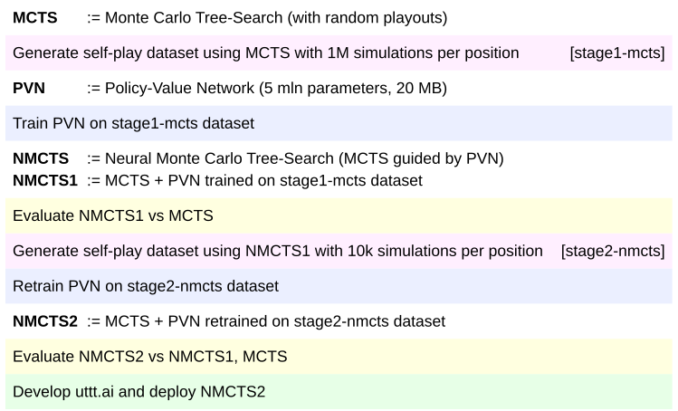
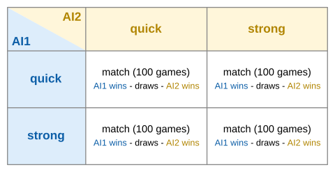
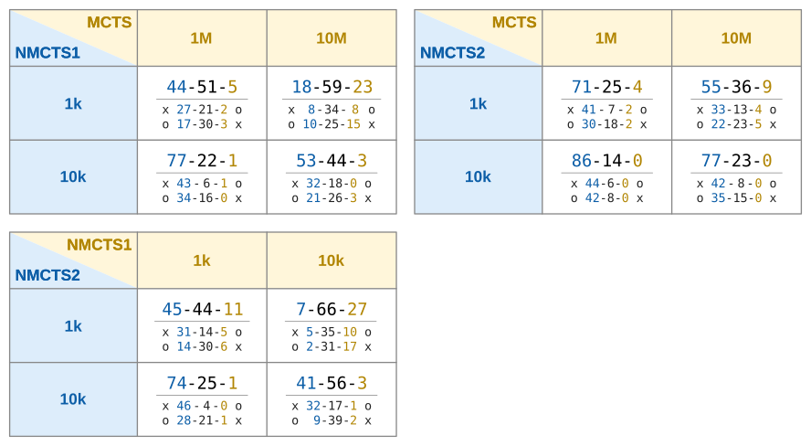
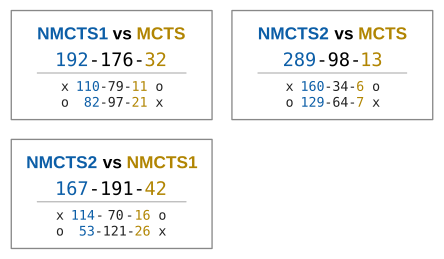

# [uttt.ai](https://uttt.ai)

AlphaZero-like AI solution for playing Ultimate Tic-Tac-Toe in the browser.

This project is a loose adaptation of the original [AlphaZero published by Deepmind](https://deepmind.com/blog/article/alphazero-shedding-new-light-grand-games-chess-shogi-and-go). It follows key ideas behind the AlphaZero, such as generating training data from self-play or using single neural network to guide the Monte-Carlo Tree Search (MCTS) algorithm. However, the actual implementation of these ideas is different due to limitations on the available computing power, specifically:

- AI self-play training must fit on a personal computer within a reasonable time (several weeks)
- AI inference must run in the browser on the client-side hardware within a reasonable time (a few seconds)

You can play Ultimate Tic-Tac-Toe with the AI on the official project website: [https://uttt.ai](https://uttt.ai).

## Overview

The project overview in chronological order:

### Differences from the original AlphaZero

- Much smaller Policy-Value Network architecture designed specifically for playing Ultimate Tic-Tac-Toe in the browser with only 5 million parameters (20 MB): [utttpy/selfplay/policy_value_network.py](utttpy/selfplay/policy_value_network.py).
- Total separation of self-play data generation process from the Policy-Value Network training (offline RL).
- More MCTS simulations per position for training (self-play data quality over quantity).
- The initial self-play dataset was generated from pure MCTS simulations (random playouts are faster and better than random Policy-Value Network predictions).
- Search simulations are synchronous, single-threaded and sequential.
- Enabled data augmentation by flipping the board during Policy-Value Network training.
- Value target for MSE loss function is defined as the root's mean state value rather than the game outcome.
- Masked KL divergence loss for policy head instead of Cross Entropy loss.
- Auxiliary policy head loss for predicting action values next to action logits.

## Evaluation

Because there is no external benchmark, a custom evaluation setup has been created to assess the overall AI performance in Ultimate Tic-Tac-Toe.

### Evaluation setup

Assessing the overall AI performance is done by playing tournaments between AIs. There are 3 AIs:

1. MCTS - Monte-Carlo Tree Search with random playouts
2. NMCTS1 - (Neural) Monte-Carlo Tree Search with Policy-Value Network guidance after training on stage1-mcts dataset
3. NMCTS2 - (Neural) Monte-Carlo Tree Search with Policy-Value Network guidance after retraning on stage2-nmcts dataset

And 3 tournaments:

1. NMCTS1 vs MCTS
2. NMCTS2 vs MCTS
3. NMCTS2 vs NMCTS1

Each AI is represented in two versions: quick and strong (to get more nuanced comparison).

| AI    | version      | num simulations | inference time |
|:------|:-------------|----------------:|---------------:|
| MCTS  | 1M (quick)   |       1,000,000 |           5.0s |
| MCTS  | 10M (strong) |      10,000,000 |          51.4s |
| NMCTS | 1k (quick)   |           1,000 |           4.4s |
| NMCTS | 10k (strong) |          10,000 |          17.8s |

Inference times were measured on Intel i7-10700K and NVIDIA GeForce RTX 2080 Ti for single-threaded C++ implementations of MCTS and NMCTS (GPU is used by NMCTS to run Policy-Value Network inference).

Each tournament consist of 4 matches (all combinations of quick/strong vs quick/strong):      Each match consist of 100 games initialized from 50 unique positions and each position is played twice (AIs swap sides for the second playthrough).

Initial evaluation positions are defined here: [utttpy/selfplay/evaluation_uttt_states.py](utttpy/selfplay/evaluation_uttt_states.py).

### Evaluation results

#### Evaluation results aggregated

Takeaways:

- Training on MCTS evaluations (stage1-mcts dataset) was successfull: NMCTS1 defeats MCTS.
- Retraining on self-play data (stage2-nmcts dataset) was successfull: NMCTS2 improves upon NMCTS1 consistently.
- NMCTS2 beats MCTS baseline even with 4 orders of magnitude difference in the number of simulations (1k vs 10M).
- Next stage (NMCTS3) is needed to see if and how much improvement is possible over NMCTS2.

NMCTS2 is deployed on the [https://uttt.ai](https://uttt.ai).

## Datasets

There are 2 datasets:

- `stage1-mcts`: 8 mln evaluated positions generated by the Monte-Carlo Tree Search self-play and used to train the Policy-Value Network from scratch.
- `stage2-nmcts`: 8 mln evaluated positions generated by the Neural Monte-Carlo Tree Search self-play and used to retrain the Policy-Value Network.

Both datasets are available for download [here](https://drive.google.com/drive/folders/10JGsynB3Sk8jAMNyIU0xW7nhEArX9xyN?usp=sharing).

Read more about datasets here: [datasets/README.md](datasets/README.md).

## Training

Training artifacts are available for download [here](https://drive.google.com/drive/folders/10VBarorReiesCd0R-r9hhMfXL6MtCNdG?usp=sharing).

## Requirements

This project was developed using:

- Ubuntu 20.04
- Python 3.8
- 2x NVIDIA GeForce RTX 2080 Ti (CUDA 11)
- Intel i7-10700K (8 cores x 3.80GHz)
- PyTorch >= 1.8
- Node.js 14.18.1
- npm 8.1.1
- React 17.0.2
- g++ 9.3.0

## License

This project is licensed under the [Apache License 2.0](LICENSE).
