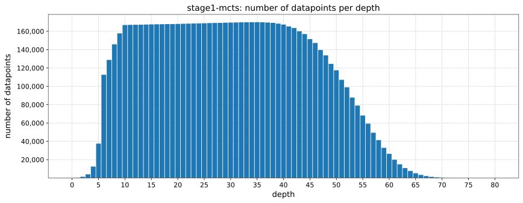
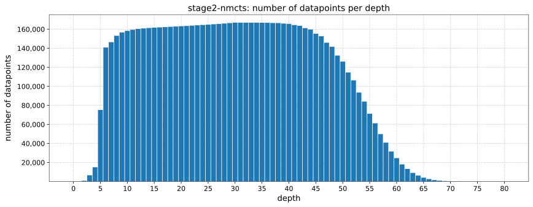

# Datasets

## stage1-mcts

The `stage1-mcts` dataset contains 8,001,990 evaluated positions (datapoints) generated by the Monte-Carlo Tree Search (MCTS) with random playouts. The average number of MCTS simulations per datapoint is: 1,359,479. Table below shows more details.

| group     | num datapoints | average num simulations |
|:----------|---------------:|------------------------:|
| nsim=1mln |      7,049,309 |               1,000,000 |
| nsim>1mln |        952,681 |               4,019,422 |
| all       |      8,001,990 |               1,359,479 |

Some positions have been evaluated with over 1 mln simulations to improve the quality and diversity of the dataset.

Datapoints are grouped by their depth, which is defined as the number of moves ([plies](https://en.wikipedia.org/wiki/Ply_(game_theory))) for a given position. The histogram below shows the number of datapoints per depth in the `stage1-mcts` dataset.



MCTS datapoints were created using: [../scripts/mcts_evaluate.py](../scripts/mcts_evaluate.py), [../scripts/mcts_generate.py](../scripts/mcts_generate.py), [../utttcpp/src/mcts-evaluate.cpp](../utttcpp/src/mcts-evaluate.cpp) and [../utttcpp/src/mcts-generate.cpp](../utttcpp/src/mcts-generate.cpp). Initial depth for self-playing was progressively deepened to avoid repeating computation.

MCTS datapoint format:
```
evaluatedState{UTTT_STATE NUM_VISITS NUM_WINS NUM_DRAWS NUM_LOSSES} evaluatedActions{SYMBOL INDEX NUM_VISITS NUM_WINS NUM_DRAWS NUM_LOSSES, ...}
```

download link: https://drive.google.com/file/d/1y7V1HWKdykuxD6Q8PNhydjPrHxkBr6vu/view?usp=sharing (815 MB, after extracting: 2.6 GB)

## stage2-nmcts

The `stage2-nmcts` dataset contains 8,023,020 evaluated positions (datapoints) generated by the Neural Monte-Carlo Tree Search (NMCTS) with Policy-Value Network trained on the `stage1-mcts` dataset. The average number of NMCTS simulations per datapoint is: 10,000. Table below shows more details.

| group    | num datapoints | average num simulations |
|:---------|---------------:|------------------------:|
| nsim=10k |      8,022,643 |                  10,000 |
| nsim>10k |            377 |                  20,610 |
| all      |      8,023,020 |                  10,000 |

Datapoints are grouped by their depth, which is defined as the number of moves ([plies](https://en.wikipedia.org/wiki/Ply_(game_theory))) for a given position. The histogram below shows the number of datapoints per depth in the `stage2-nmcts` dataset.



NMCTS datapoints were created using: [../scripts/nmcts_evaluate.py](../scripts/nmcts_evaluate.py), [../scripts/nmcts_evaluate_parallel.py](../scripts/nmcts_evaluate_parallel.py), [../scripts/nmcts_generate.py](../scripts/nmcts_generate.py), [../scripts/nmcts_generate_parallel.py](../scripts/nmcts_generate_parallel.py), [../utttcpp/src/nmcts-evaluate.cpp](../utttcpp/src/nmcts-evaluate.cpp) and [../utttcpp/src/nmcts-generate.cpp](../utttcpp/src/nmcts-generate.cpp). Initial depth for self-playing was progressively deepened to avoid repeating computation.

NMCTS datapoint format:
```
evaluatedState{UTTT_STATE VISIT_COUNT STATE_VALUE_MEAN} evaluatedActions{SYMBOL INDEX VISIT_COUNT STATE_VALUE_MEAN, ...}
```

download link: https://drive.google.com/file/d/1BxsJ8BmcluRLI6WK8ElIVVwLhCtjn2kQ/view?usp=sharing (481 MB, after extracting: 2.1 GB)
